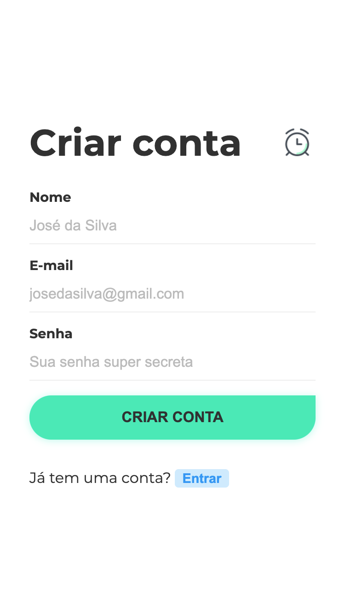

# Clocking Tracker App

An app to track your working hours.



## Description

This is a simple app that will help you calculate your working hours in a day
and will give you a summary of how many hours you are working in a month.

## Installation

```bash
$ yarn install && cd client && yarn install && cd ..

# copy .env.example to .env
cp .env.example .env
```

### Env vars

Configure the variables on the `.env` file for the database connection and a key
to your JWT tokens signature. See the `.env.example` file.

## Running the app

```bash
# development
$ npm run start
```

## Test Backend

```bash
# unit tests
$ npm run test

# e2e tests
$ npm run test:e2e

# test coverage
$ npm run test:cov
```

## Test Frontend

```bash
$ cd client
$ npm run test
```

## Build - Locally

```bash
# build both api and frontend
$ npm run build

# run production build on local machine
$ npm run start:prod
```

## Stack

### Frontend

- React
- styled-components
- redux
- redux-saga
- reselect
- immer
- axios
- react-router
- moment
- jest

### Backend

- Nestjs
- Typescript
- Mongoose
- passport

## License

[MIT licensed](LICENSE).
